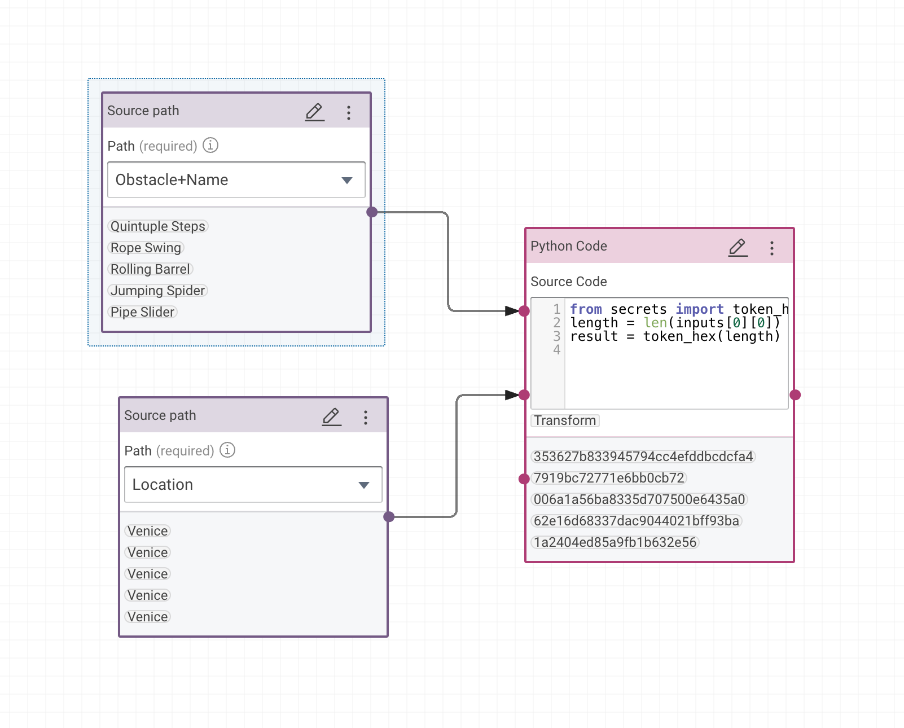

# cmem-plugin-python

Write ad-hoc transformations and workflow tasks with Python.

Do not use in production!

```
eval $(cmemc -c my-cmem config eval)
task clean check install
```

😈


[![eccenca Corporate Memory][cmem-shield]][cmem-link][](https://github.com/eccenca/cmem-plugin-python/actions) [](https://pypi.org/project/cmem-plugin-python) [](https://pypi.org/project/cmem-plugin-python)
[![poetry][poetry-shield]][poetry-link] [![ruff][ruff-shield]][ruff-link] [![mypy][mypy-shield]][mypy-link] [![copier][copier-shield]][copier] 

## Development

- Run [task](https://taskfile.dev/) to see all major development tasks.
- Use [pre-commit](https://pre-commit.com/) to avoid errors before commit.
- Agent instructions and skills for this project are in `.claude/` - your own
  instructions belong in `CLAUDE.md`, which is never overwritten.
- This repository was created with [this copier template](https://github.com/eccenca/cmem-plugin-template).

### Manual validation project

`tests/fixtures/cmem-plugin-python-testing.project.zip` is an export of a
DataIntegration project which drives both plugins against a real deployment -
the kind of check the unit tests cannot make, because a Python task only shows
its true behaviour once DataIntegration loads it, negotiates its ports and runs
it inside a workflow. Install the plugin first, then import it:

```
task install
cmemc project import tests/fixtures/cmem-plugin-python-testing.project.zip cmem-plugin-python-testing
```

Start with the **Run all (green workflows)** workflow, which chains the six
workflows that are supposed to pass. Between them they cover reading through
`client.graphs` and `client.queries`, writing with SPARQL Update from a task
with no output port, installing a declared dependency, two fixed schema input
ports, and the transform operator. Every workflow carries a sticky note saying
what it proves, and the project description tabulates them.

Three workflows stay out of that chain because each one is red:

- **Expected failure** is meant to fail. It sends malformed SPARQL to show that
  an exception raised inside execution code reaches the execution report.
- **Flexible ports** and **Flexible ports (declared)** fail on a finding: a
  Python task whose input port has a flexible schema cannot be fed by the JSON
  dataset, aborting with `array assignment index out of range: 0` before a
  single entity is processed. The same task fed by a task with a fixed output
  schema is green, which is why fixed schema ports are the ones to declare.
  Reported upstream as
  [cmem-plugin-template#79](https://github.com/eccenca/cmem-plugin-template/issues/79).

Running the project changes the deployment: it installs `example-pypi-package`
and writes the graph
`https://ns.eccenca.com/example/cmem-plugin-python-testing/property-counts/`.

The older `tests/fixtures/cmem_plugin_python_testing.project.zip` (note the
underscores) is a separate CSV based demo from 2023 which nothing references.


[cmem-link]: https://documentation.eccenca.com
[cmem-shield]: https://img.shields.io/endpoint?url=https://documentation.eccenca.com/latest/badge.json
[poetry-link]: https://python-poetry.org/
[poetry-shield]: https://img.shields.io/endpoint?url=https://python-poetry.org/badge/v0.json
[ruff-link]: https://docs.astral.sh/ruff/
[ruff-shield]: https://img.shields.io/endpoint?url=https://raw.githubusercontent.com/astral-sh/ruff/main/assets/badge/v2.json&label=Code%20Style
[mypy-link]: https://mypy-lang.org/
[mypy-shield]: https://www.mypy-lang.org/static/mypy_badge.svg
[copier]: https://copier.readthedocs.io/
[copier-shield]: https://img.shields.io/endpoint?url=https://raw.githubusercontent.com/copier-org/copier/master/img/badge/badge-grayscale-inverted-border-purple.json

